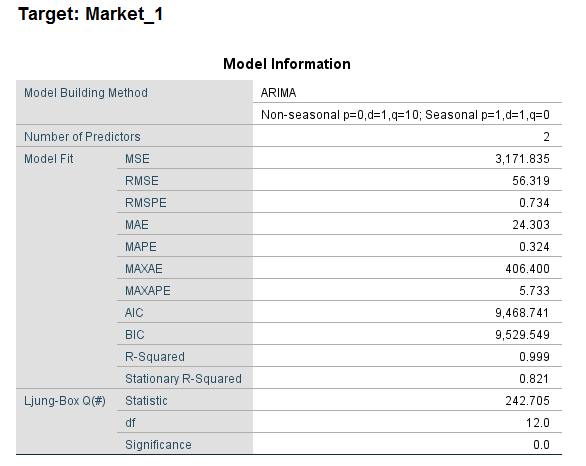

# Time Series Market Prediction Project

by Stan Chen on Dec 12, 2019

This project is a simple standard time series analysis with IBM SPSS.  While other tools and technologies can achieve the exact same results(i.e. KNIME, SageMaker, etc.) , I find the graphs and reports from IBM products concise and easy to explain. 

Data source:

https://www.kaggle.com/census/retail-and-retailers-sales-time-series-collection#MRTSSM44111USN.csv

| Process Name        | Tools Used       | Estimate |
| ------------------- | ---------------- | -------- |
| Data Wrangling      | Excel            | 10 min   |
| Modeling & Forecast | IBM SPSS Modeler | 15 min   |
| Documentation       | Markdown         | 30 min   |

### Wrangled Source Sample

# Time Series Predictive Modeling Parameters

| Parameter                        | Setting              |
| -------------------------------- | -------------------- |
| Time Interval                    | Years                |
| Missing Value Handling           | Linear Interpolation |
| 1st forecast project interval    | 3                    |
| 2nd forecast projection interval | 200                  |

After all the parameters are set and the stream is built, I've then feed the data to train the time-series model.

# Stream Design and Time Series Model Training

# Observing Output

Benchmarking the Market_1 predictive output against real data, we can observe that the predictive model has a strong fit with the historic data.  

# Predicting the future Market_1 Values using the predictive model

Based on the historic data, I've computed a 200 time interval projection (5 years), we can see that the predicted value follows the market pattern versus linear trend-line, which would provides better and more accurate predictions.  

# Insight Discovery

In this demo project, we're interested in finding out how many predictors( i.e. Stainless Steel Market vs. Iron Ore Market ) each market is using and how well do they benchmark. 

From the parameters estimates we can examine the Market 1 is currently using two predictors and which lag feature is used by the system as a feature / predictor.  based on the Stationary R-Square, we have to say this prediction model is significantly better than Baseline Model by an index of 0.81 (maximum of Stationary R-Squared is 1)

By examining Market_4, we can find out that this market has strong connection with 4 other markets: Market 1, 2, 3, and 5, and their corresponding lag features are listed below:

This insight is important to us because in future data analysis, we can prioritize the relevant data source for more streamlined predictive analysis work. 

